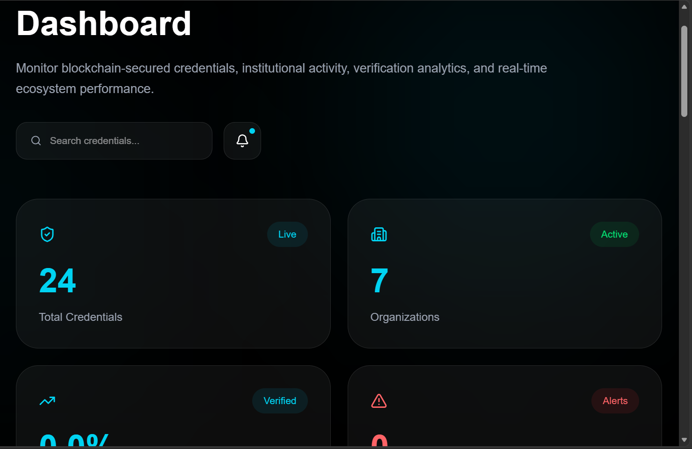
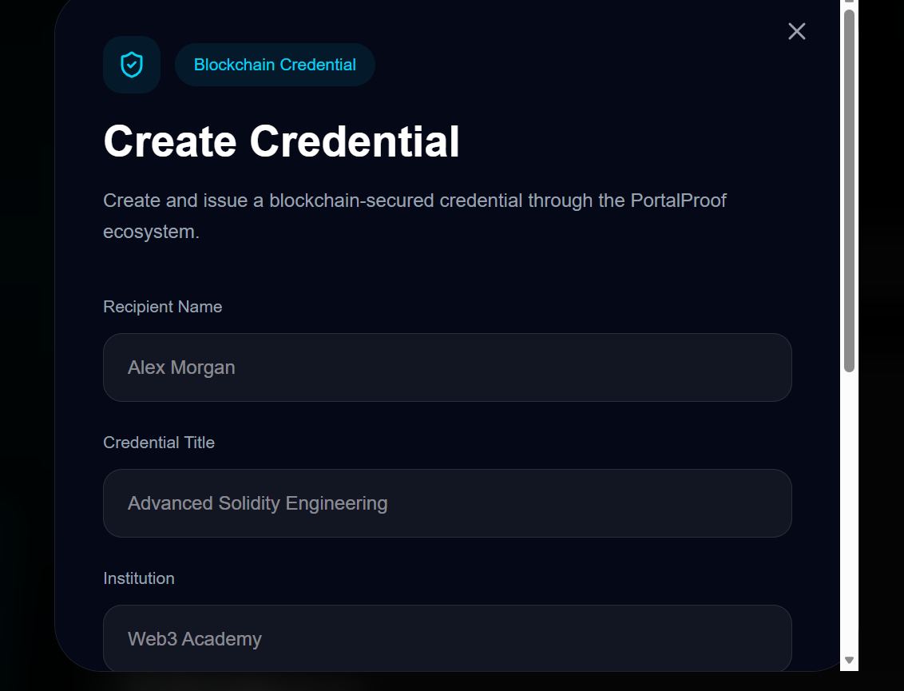
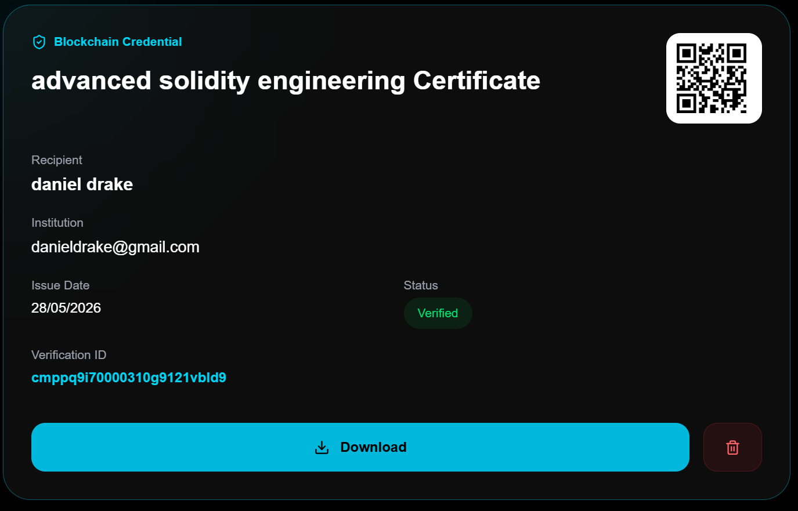
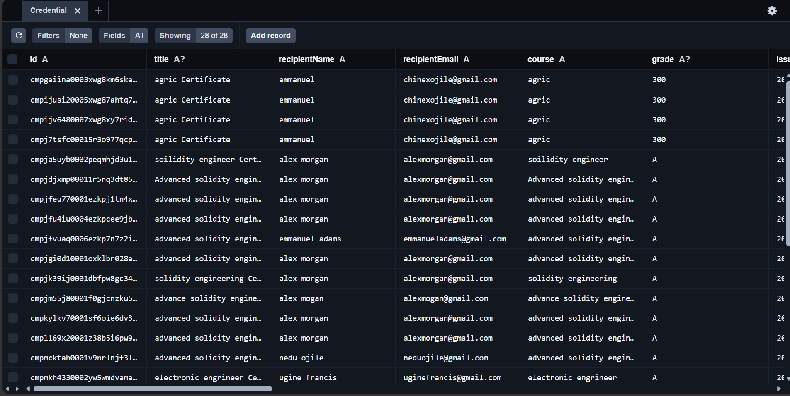
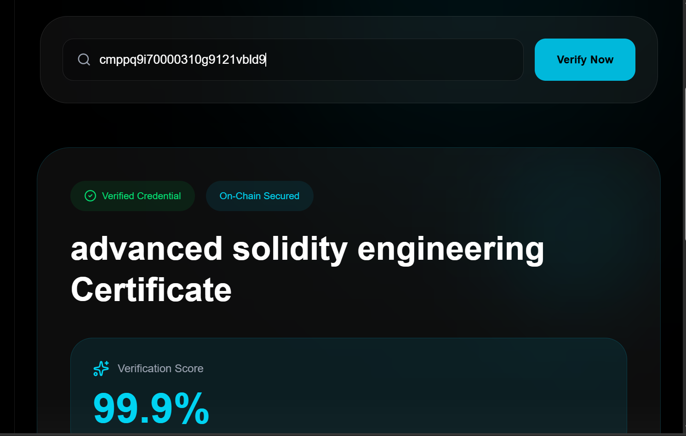
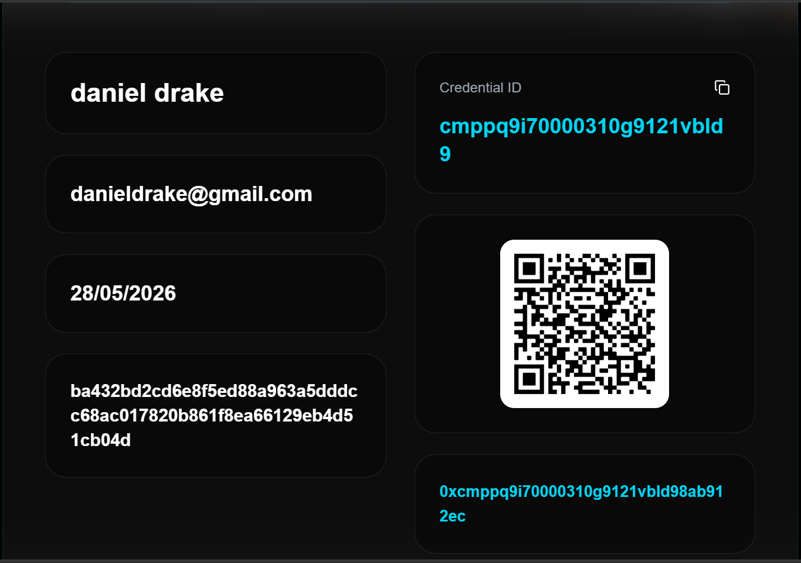
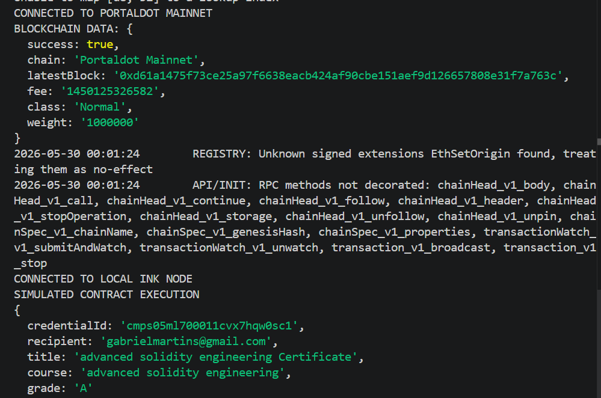
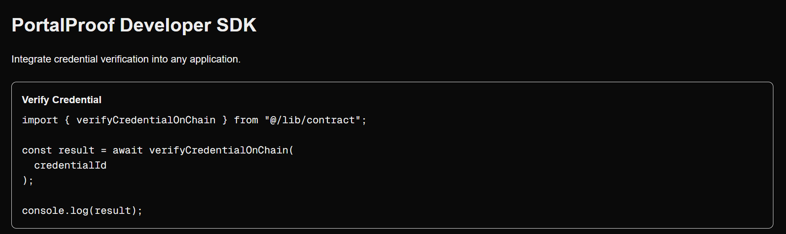
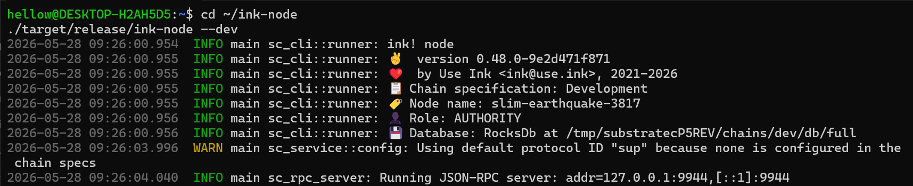

# PortalProof

Blockchain-powered credential issuance and verification platform built for the Portaldot ecosystem.

PortalProof enables institutions to issue secure, verifiable, and tamper-resistant digital credentials using blockchain-backed verification and QR authentication.


# Overview

Fake certificates and unverifiable academic records remain a major challenge across universities, online learning platforms, and professional institutions.

PortalProof solves this problem by providing a decentralized credential verification system where institutions can issue trusted digital certificates that can be verified instantly through unique QR codes and blockchain-linked references.

The platform combines modern fullstack architecture with blockchain integration to create a transparent and scalable verification infrastructure for Web3 education and digital identity systems.


# Core Features

- Digital credential issuance
- Dynamic credential verification
- QR code certificate validation
- Blockchain transaction reference generation
- POT fee tracking
- Credential revocation system
- Institution management
- Analytics dashboard
- Verification pages
- PDF-ready certificate structure
- Responsive UI/UX
- Prisma + PostgreSQL database integration
- Substrate / Portaldot integration setup


# Tech Stack

## Frontend
- Next.js
- React
- TypeScript
- Tailwind CSS

## Backend
- Next.js API Routes
- Prisma ORM
- PostgreSQL

## Blockchain
- Portaldot
- Substrate SDK
- Rust
- ink! Smart Contracts


# Project Structure

```bash
app/
├── (platform)/
│   ├── analytics/
│   ├── credentials/
│   ├── dashboard/
│   ├── organizations/
│   ├── settings/
│   ├── verification/
│   └── layout.tsx
│
├── api/
│   ├── credentials/
│   │   ├── issue/
│   │   ├── revoke/
│   │   └── verify/
│   │       └── [id]/
│   │
│   └── dashboard/
│       ├── stats/
│       └── route.ts
│
├── credential/
│   └── [id]/
│
├── issue/
├── verify/
│   └── [id]/
│
├── components/
├── globals.css
├── layout.tsx
├── page.tsx
└── Providers.tsx

blockchain/
├── contracts/

portalproof_contract/
├── lib.rs
├── Cargo.toml

prisma/
├── schema.prisma
├── migrations/

public/
├── contracts/
├── certificate-template.png

src/
└── lib/
    └── contract.ts
```


# Installation

## Clone Repository

```bash
git clone https://github.com/neduojile/portalproof.git
```


## Install Dependencies

```bash
npm install
```


## Setup Environment Variables

Create a `.env` file:

```env
DATABASE_URL="your_database_url"
```


## Setup Prisma

```bash
npx prisma generate
npx prisma migrate dev
```


## Run Development Server

```bash
npm run dev
```

Application runs on:

```bash
http://localhost:3000
```


# Running Local Portaldot Node

```bash
cd polkadot-sdk
cargo run --release --bin substrate-node -- --dev
```


# MVP Demo Flow

1. Open credential issuance page
2. Enter student details
3. Generate credential
4. Generate blockchain reference
5. Generate QR code
6. Verify credential dynamically
7. Display verification result
8. View POT fee tracking


# API Endpoints

## Credential APIs

### Issue Credential

```bash
POST /api/credentials/issue
```

### Verify Credential

```bash
GET /api/credentials/verify/[id]
```

### Revoke Credential

```bash
POST /api/credentials/revoke
```


# Current MVP Status

## Completed
- Credential issuance flow
- Verification flow
- QR generation
- Dashboard structure
- Blockchain integration setup
- Database integration
- Dynamic routes
- API architecture

## In Progress
- Full onchain transaction execution
- Advanced smart contract interactions
- Wallet authentication
- Production deployment


# Developer SDK

PortalProof is being developed with developer usability in mind.

The platform exposes reusable blockchain interaction utilities that allow future ecosystem projects to integrate credential verification with minimal setup.

Example integration:

```typescript
import {
  verifyCredentialOnChain
} from "@/src/lib/contract";

const result =
  await verifyCredentialOnChain(
    credentialId
  );
```

Credential verification can be integrated with only a few lines of code.

Future releases will expose a dedicated SDK package for ecosystem developers.

# Smart Contract Development

PortalProof includes a custom ink! smart contract for credential lifecycle management.

Implemented functionality includes:

* Credential issuance
* Credential verification
* Credential revocation
* Credential status checking

Contract methods:

```text
issue_credential()
verify_credential()
revoke_credential()
is_revoked()
```

The contract was compiled successfully and contract artifacts were generated for deployment and testing.

# Infrastructure-Focused MVP

PortalProof is intentionally positioned as infrastructure rather than a consumer-facing application.

Success metrics for this MVP focus on:

* Clean architecture
* Blockchain integration
* Verification workflow reliability
* Smart contract readiness
* Developer extensibility
* Credential authenticity

The current MVP demonstrates the complete credential lifecycle from issuance to verification while establishing the foundation for future onchain execution within the Portaldot ecosystem.

# Current Blockchain Status

The MVP currently demonstrates:

* Successful Portaldot connectivity
* Blockchain metadata retrieval
* Fee estimation workflows
* Local ink! runtime connectivity
* Smart contract compilation
* Contract artifact generation
* Credential lifecycle simulation
* QR-based verification flow

To ensure stable demonstrations during the hackathon, credential issuance currently uses a simulated execution layer while preserving the full blockchain integration architecture. Future releases will transition to full production onchain credential execution.

# Why PortalProof

Educational institutions, certification providers, training organizations, and employers often face challenges validating the authenticity of academic and professional credentials.

PortalProof addresses this challenge by providing:

* Tamper-resistant credential records
* Instant verification workflows
* QR-enabled certificate validation
* Blockchain-backed auditability
* Institution-friendly credential management
* Developer-friendly integration architecture

The long-term vision is to become a reusable credential verification layer for applications built throughout the Portaldot ecosystem.


# Screenshots


## Dashboard



---


## Credential Issuance






---


## Database Persistence

### PostgreSQL + Prisma Studio




PortalProof stores issued credentials, user records, institutions, and verification data in PostgreSQL through Prisma ORM.

This screenshot shows credential records successfully persisted and accessible through Prisma Studio, demonstrating backend data integrity and credential lifecycle management.
---


## Verification System







---


## Developer SDK



[Developer SDK](./public/screenshots/sdk-page2.png)

---


## Local ink! Runtime


---


## Credential Issuance
- QR code generation
- Blockchain hash generation
- POT fee display

## Verification System
- Dynamic verification pages
- Credential validation flow

## Dashboard
- Analytics and credential management


# Future Improvements

* Full production onchain credential execution
* Universal PortalProof SDK package
* Real-time blockchain verification
* Multi-wallet support
* Institution onboarding portal
* NFT credential issuance
* Decentralized identity integration
* Cross-project Portaldot ecosystem integrations
* Advanced analytics dashboard
* Automated verifier APIs
* Production deployment
* Ecosystem developer plugins
* Mobile verification support
* Account abstraction wallet integration
* Verifiable credential standards support


# GitHub Repository

https://github.com/neduojile/portalproof

---

# Developer

Xavi  
Full Stack Developer  
Frontend & Backend Engineer