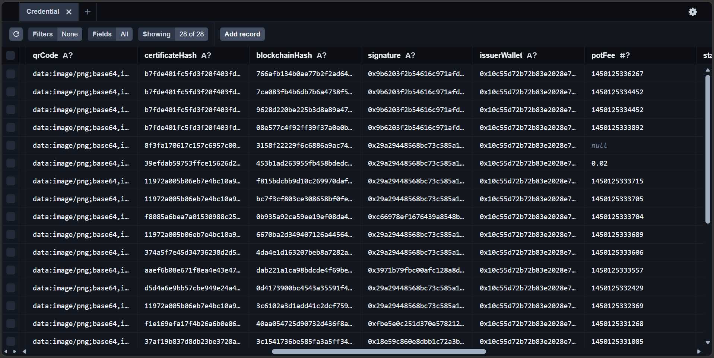
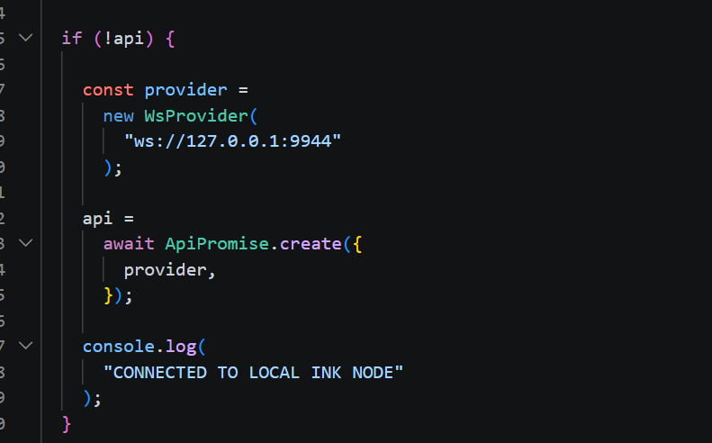

# PortalProof

Blockchain-powered credential issuance and verification infrastructure built for the Portaldot ecosystem.

---

# Project Overview

## Problem Statement

Fake certificates and unverifiable academic records remain a major challenge across universities, training institutions, certification providers, and employers.

Traditional verification processes are often manual, slow, and vulnerable to fraud.

## Solution

PortalProof enables institutions to issue trusted digital credentials and allows third parties to verify them instantly through QR authentication and blockchain-linked references.

### Core Features

* Credential Issuance
* Credential Verification
* QR Authentication
* Analytics Dashboard
* PostgreSQL Persistence
* Portaldot Integration Architecture
* ink! Smart Contract Tooling
* Developer SDK Foundation

## Blockchain Relevance

PortalProof leverages Portaldot integration architecture, Substrate tooling, and ink! smart contract development to establish a foundation for blockchain-backed credential verification.

The platform combines credential issuance workflows, verification systems, QR authentication, database persistence, and smart contract tooling to create trusted digital credential infrastructure.

---

# Technical Architecture

## Architecture Flow

Institution → PortalProof Platform → PostgreSQL Database → Verification Layer → Portaldot Integration Layer → ink! Smart Contract Infrastructure

## Core Tech Stack

### Blockchain Platform

* Portaldot
* Substrate

### Smart Contract Language

* Rust
* ink!

### Frontend

* Next.js
* React
* TypeScript
* Tailwind CSS

### Backend

* Next.js API Routes
* Prisma ORM

### Database

* PostgreSQL

---

# Smart Contracts

## Contract Directory

```bash
portalproof_contract/
```

## Key Contract

```bash
portalproof_contract/lib.rs
```

### Core Functions

* issueCredential()
* verifyCredential()
* revokeCredential()

## Contract Artifacts

```bash
public/contracts/ink/
```

Generated contract artifacts:

* portalproof_contract.contract
* portalproof_contract.json
* portalproof_contract.wasm

---

# Installation & Setup

## Requirements

* Node.js
* PostgreSQL
* Rust
* Cargo
* ink! Tooling

## Clone Repository

```bash
git clone https://github.com/neduojile/portalproof.git
```

## Install Dependencies

```bash
npm install
```

## Configure Environment Variables

Create a `.env` file:

```env
DATABASE_URL="your_database_url"
```

## Setup Prisma

```bash
npx prisma generate

npx prisma migrate dev
```

## Start Development Server

```bash
npm run dev
```

Application runs on:

```bash
http://localhost:3000
```

## Run Prisma Studio

```bash
npx prisma studio
```

## Run Local ink! Development Node

```bash
./target/release/ink-node --dev
```

---

# Demo

## GitHub Repository

https://github.com/neduojile/portalproof

## Demo Video

https://youtu.be/FHMkiWdv6HY

---

# Screenshots

## Dashboard


---


## Credential Issuance


---


## Database Persistence

### PostgreSQL + Prisma Studio





PortalProof stores issued credentials, user records, institutions, and verification data in PostgreSQL through Prisma ORM.

This screenshot shows credential records successfully persisted and accessible through Prisma Studio, demonstrating backend data integrity and credential lifecycle management.
---


## Verification System


---


## Developer SDK




---


## Local ink! Runtime


---

# Roadmap

## Completed Features

* Credential Issuance Workflow
* Credential Verification Workflow
* QR Code Generation
* PostgreSQL Persistence
* Analytics Dashboard
* Dynamic Verification Pages
* Portaldot Integration Architecture
* ink! Smart Contract Tooling
* SDK Foundation

## Next Phase

* Production On-Chain Credential Execution
* Wallet Authentication
* Decentralized Identity Integration
* NFT Credentials
* Multi-Institution Verification Network
* Universal SDK Package
* Ecosystem Integrations
* Production Deployment

---

# Team

## Team Name

Solo builder 

## Developer

Xavi

## Role

Full Stack Blockchain Developer

### Responsibilities

* Product Design
* Frontend Development
* Backend Development
* PostgreSQL Database Design
* Prisma ORM Integration
* Smart Contract Development
* Portaldot Integration Architecture
* SDK Development
* Testing
* Documentation

---

# License

MIT License


